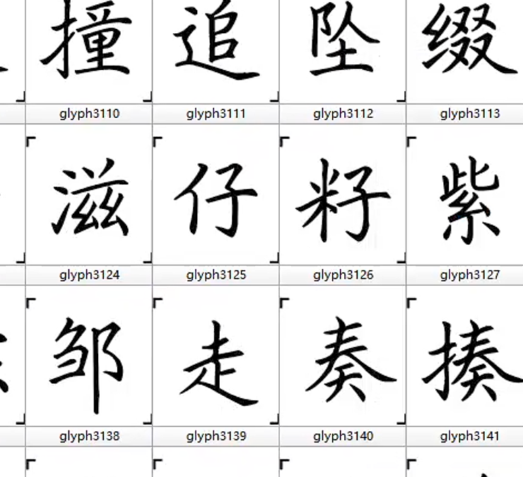
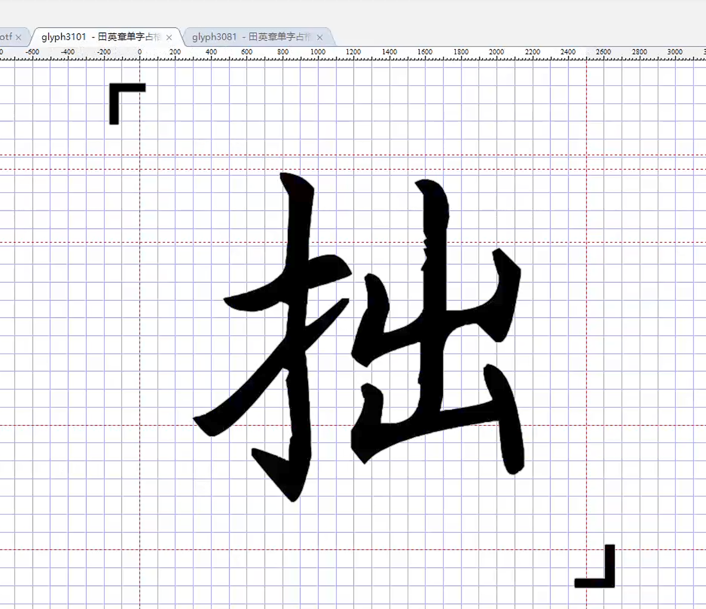

# 字体占格角标批量清除工具

> 针对「田英章单字占格」一类练字字库，批量删除每个字左上角、右下角的 L 形占格角标，干净彻底、不伤笔画。

  -lightgrey) 

---

## 这是什么

很多练字、占格字库（典型如「田英章单字占格」）会在**每个字的左上角和右下角**各放一个 L 形（竖+横）的黑色小角标，用来标记田字格的位置。直接拿去做设计、排版时，这两个角标就成了多余的杂点。

本工具会**批量扫描整套字库的所有字形**，把这两处角标的轮廓**直接删除**（是删掉轮廓，不是用白色方块盖住），处理后另存为新字体文件，原字体保持不变。

| 处理前 | 处理后 |
|:---:|:---:|
|  |  |

---

## 工作原理

通过对本类字库（实测 6784 个字形，em = 2048）的全量统计发现：角标轮廓始终落在字身之外的两个极角区，真实笔画绝不会进入这些区域。因此用纯几何判据即可精准识别，**不会误删任何文字笔画**：

- **左上角标（TL）**：整条轮廓 `maxX < 0.20·em` 且 `minY > 0.72·em`
- **右下角标（BR）**：整条轮廓 `minX > 1.05·em` 且 `maxY < -0.25·em`
- 角标点数很少（实测 16~18 个点），凡轮廓点数 `> 40` 的一律视为真实笔画，绝不删除

阈值全部以「相对 em 大小」表达，对不同 `unitsPerEm` 的字体通用。删除角标后还会：

- 清空该字形过时的 TrueType hinting 指令（避免引用到已删除的点导致渲染异常）；
- 重算单字形包围盒与整套字体的全局包围盒（`head` 表），去掉被角标撑大的范围。

---

## 两种使用方式

### 方式一：直接运行 exe（免安装，推荐普通用户）

双击 **`字体角标清除工具.exe`** 即可，无需安装 Python 环境。

### 方式二：运行 Python 源码（开发者）

```bash
# 1. 安装依赖
pip install fonttools Pillow

# 2. 运行
python 字体角标清除工具.py
```

> 说明：`fonttools` 为必需依赖；`Pillow` 仅用于「处理前 / 处理后」的图形预览，未安装时程序仍可正常清除角标，只是不显示预览。

---

## 操作步骤

1. 点击 **「浏览…」** 选择源字体（`.ttf` / `.otf`），程序会自动生成输出路径 `原名_已清角标.扩展名`；
2. 如需可在 **「另存为…」** 中自定义输出路径（输出路径不能与源字体相同）；
3. 在 **「预览字符」** 框输入一个汉字（默认「拙」），点 **「预览处理前」** 查看角标效果；
4. 点击 **「开始批量清除角标」**，处理在后台线程进行，进度条与日志实时刷新；
5. 完成后右侧自动渲染处理后效果，并弹窗显示统计：删除角标的字数、删除的轮廓总数、输出文件路径。

---

## 限制与注意

- 仅支持 **TrueType（`glyf` 轮廓）** 字体。若字体不含 `glyf` 表（如纯 CFF/OTF 轮廓），会提示「暂不支持」。
- 复合字形（`numberOfContours < 0`）和空字形不处理。
- 几何阈值是针对「左上 + 右下两处角标」的字库标定的；若你的字库角标在其他位置或形态差异较大，可能需要调整源码顶部的 `TL_*` / `BR_*` / `MAX_PTS` 参数。
- 始终输出到新文件，**不会覆盖源字体**，可放心使用。

---

## 文件清单

| 文件 | 说明 |
|---|---|
| `字体角标清除工具.py` | 程序源码（GUI + 核心算法） |
| `字体角标清除工具.exe` | 打包好的可执行程序，免安装 |
| `图片1.png` / `图片2.png` | 处理前 / 处理后效果图 |
| `田英章单字占格(1)(1).otf` | 示例源字体 |
| `田英章单字占格(1)(1)_已清角标.otf` | 示例处理结果 |
| `FontCreator13_安装程序 - 叶子书法教材设计.exe` | 配套字体编辑软件安装包（第三方） |

---

## 关键参数（源码 `字体角标清除工具.py` 顶部）

```python
TL_MAX_X = 0.20    # 左上角标：maxX < 0.20*em
TL_MIN_Y = 0.72    # 左上角标：minY > 0.72*em
BR_MIN_X = 1.05    # 右下角标：minX > 1.05*em
BR_MAX_Y = -0.25   # 右下角标：maxY < -0.25*em
MAX_PTS  = 40      # 超过此点数的轮廓一律视为真实笔画，绝不删除
```

---

<div align="center">

@2026 速光网络软件开发 · [suguang.cc](https://suguang.cc) · 抖音：dubaishun12

</div>
